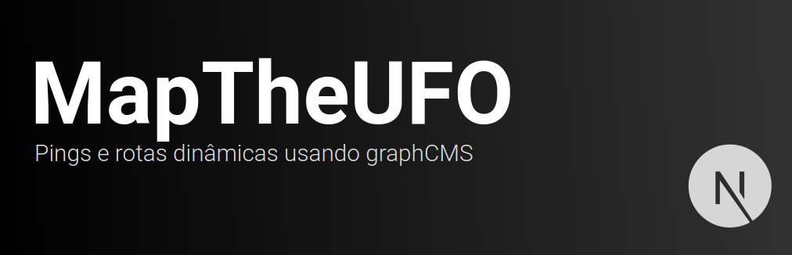
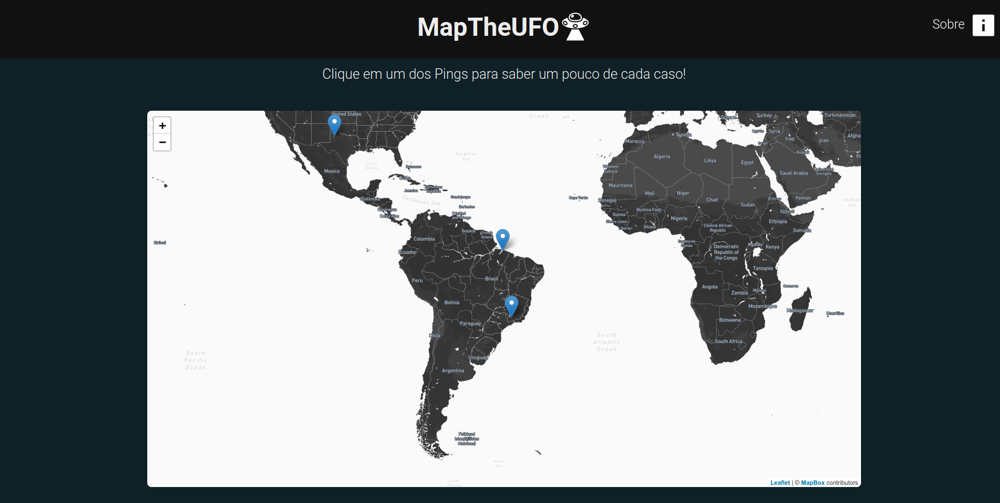
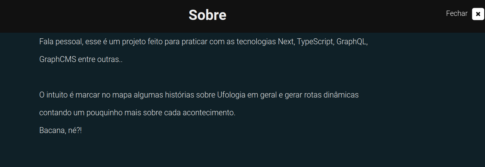
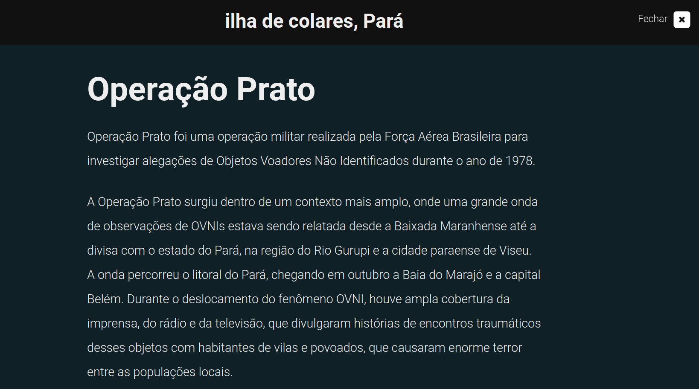

<br />

# :pushpin: Índice
- [Mídia](#camera_flash-mídia)
- [Sobre](#monocle_face-sobre)
- [Tecnologias](#rocket-tecnologias)
- [Instalação](#hammer_and_wrench-instalação)
- [Autor](#closed_book-autor)
<br />

---

# :camera_flash: Mídia









<br />

---
# :monocle_face: Sobre
Esse projeto foi feito com a intenção de praticar Next utilizando GraphQL / GraphCMS.

Os Pings no mapa são gerados de forma dinâmica através do GraphCMS sendo integrados ao mapa do Leaflet.

As rotas dos pings também são geradas de forma dinâmica através do GraphCMS, sendo um slug único (Nome da localidade) usado para criar de fato a rota.

O ambiente para utilizar Jest foi desenvolvido mas apenas alguns pequenos testes foram feitos utilizando a React Testing Library :)
<br />

---

# :rocket: Tecnologias
Esse projeto foi feito utilizando as seguintes tecnologias: <br>
- :heavy_check_mark: **React**
- :heavy_check_mark: **Next**
- :heavy_check_mark: **TypeScript**
- :heavy_check_mark: **GraphQL**
- :heavy_check_mark: **GraphCMS**
- :heavy_check_mark: **Styled Components**
- :heavy_check_mark: **Leaflet**
- :heavy_check_mark: **ESLint**
- :heavy_check_mark: **Prettier**
- :heavy_check_mark: **Jest / RTL**
<br><br>
<br />

---

# :hammer_and_wrench: Instalação
**Esse projeto envolve muitas variáveis ambientes, tenha certeza de que você as possui antes de tentar executar!**

1. Clone o repositório

```bash
git clone git@github.com:PatrickMoraisN/MapTheUFO.git
```

2. Mude para o diretório do repositório

```bash
cd MapTheUFO
```

3. Instale as dependências

```bash
npm install
```

4. Crie um arquivo `.env.local` na raíz do seu projeto e adicione as variáveis ambientes

```bash
# GraphQL / GraphCMS

ENDPOINT_GRAPHCMS=YOUR_GRAPHCMS_ENDPOINT
GRAPHQL_TOKEN=YOUR_GRAPHQL_ACCESS_TOKEN

# MapBox

NEXT_PUBLIC_MAPBOX_API_KEY=YOUR_MAPBOX_ACCESS_TOKEN
NEXT_PUBLIC_MAPBOX_USER=YOUR_MAPBOX_KEY
NEXT_PUBLIC_STYLE_ID=YOUR_MAPBOX_STYLE_KEY

```

5. Inicie o app

```bash
npm run dev
```

Ta tudo pronto! Abra em [localhost:3000](http://localhost:3000/) para ver o app!

---

# :closed_book: Autor
Patrick Morais <br>
[](https://www.linkedin.com/in/patrick-morais/)<br>
[](mailto:ppternunes@gmail.com)<br>
[](https://www.github.com/patrickmoraisn/)
